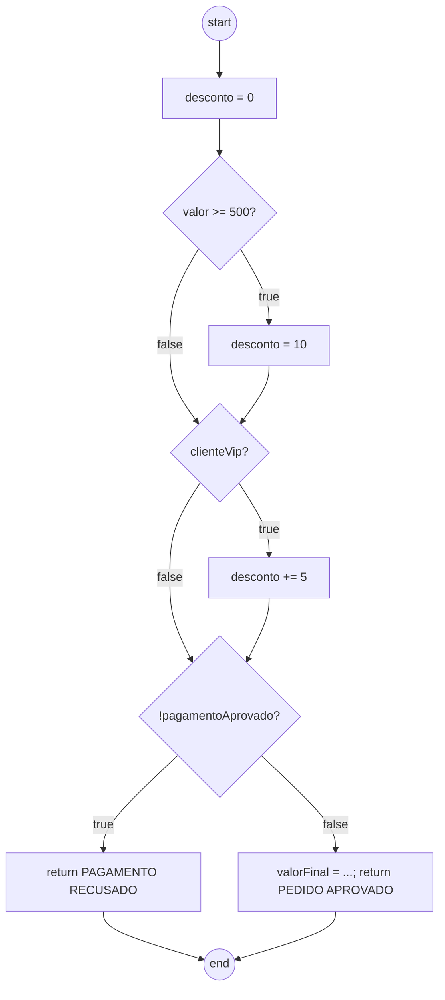
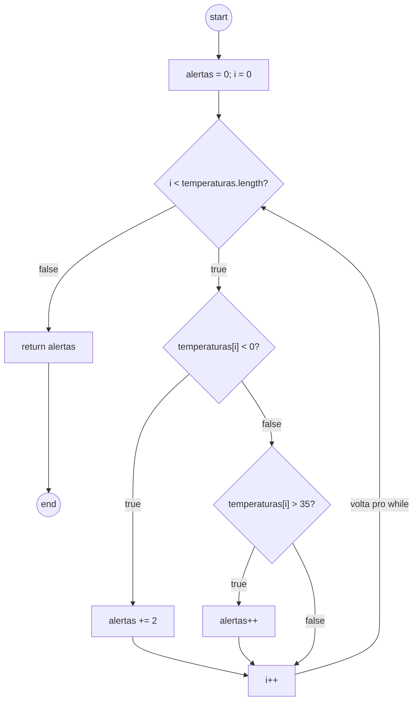

# Exercícios de Grafo de Fluxo de Controle

Resolução dos dois exercícios da revisão da SEMANA07.

Pra montar os dois grafos usamos a mesma lógica do relatório da atividade 3:
cada `if`/`else if` vira um nó de decisão, laço tem um nó de decisão com
aresta voltando pra ele mesmo, e todo `return` termina no mesmo nó final
(`end`), pra dar pra calcular `V(G) = E - N + 2` direito.

## Exercício 1 - Classificação de pedido

```java
public String classificarPedido(
        double valor,
        boolean clienteVip,
        boolean pagamentoAprovado) {

    double desconto = 0;

    if (valor >= 500) {
        desconto = 10;
    }

    if (clienteVip) {
        desconto += 5;
    }

    if (!pagamentoAprovado) {
        return "PAGAMENTO RECUSADO";
    }

    double valorFinal = valor - (valor * desconto / 100);
    return "PEDIDO APROVADO: " + valorFinal;
}
```

### Blocos básicos

- B0: `desconto = 0;`
- B1: `desconto = 10;`
- B2: `desconto += 5;`
- B3: `return "PAGAMENTO RECUSADO";`
- B4: `valorFinal = ...; return "PEDIDO APROVADO: " + valorFinal;`

### Decisões

- D1: `valor >= 500`
- D2: `clienteVip`
- D3: `!pagamentoAprovado`

### Grafo



O `return` de dentro do terceiro `if` fica bem visível no grafo: ele sai
direto pro `end` sem passar pelo bloco `B4`, que é onde o `valorFinal` é
calculado.

### Contagem e complexidade

Nós = 9 (start, B0, D1, B1, D2, B2, D3, B3, B4, end - contando start e B0
como um nó só de entrada). Arestas = 11.

`V(G) = E - N + 2 = 11 - 9 + 2 = 4`

Confirmando pelas decisões: 3 decisões + 1 = 4. Bate.

### Base de caminhos independentes

| Caminho | D1 | D2 | D3 | Entrada | Resultado |
| --- | --- | --- | --- | --- | --- |
| P1 | F | F | F | valor=100, vip=false, pagamentoAprovado=true | PEDIDO APROVADO: 100.0 |
| P2 | T | F | F | valor=600, vip=false, pagamentoAprovado=true | PEDIDO APROVADO: 540.0 |
| P3 | F | T | F | valor=100, vip=true, pagamentoAprovado=true | PEDIDO APROVADO: 95.0 |
| P4 | - | - | T | valor=100, vip=false, pagamentoAprovado=false | PAGAMENTO RECUSADO |

P1 a P3 cobrem as combinações de D1 e D2. P4 é o único que passa pela saída
antecipada de D3, então não importa o que D1/D2 dariam nesse caso.

### Discussão

Quantas combinações entre as três condições são possíveis? 2³ = 8.

O número de combinações é igual à complexidade ciclomática? Não. V(G) mede
quantos caminhos independentes o grafo tem, não quantas combinações de
entrada existem. Como D3 verdadeiro sempre cai no mesmo lugar (B3) não
importa o que D1 e D2 valem, várias das 8 combinações acabam caindo no
mesmo caminho do grafo. Por isso dá 4 e não 8.

Como o `return` dentro da terceira condição altera o grafo? Ele cria uma
saída que não passa pelo cálculo de `valorFinal`. Sem ele, o método teria
um final só; com ele, tem dois pontos de saída (B3 e B4).

É possível executar o cálculo de `valorFinal` quando o pagamento não foi
aprovado? Não, o `return` corta o método antes de chegar nessa linha.

## Exercício 2 - Análise de leituras de temperatura

```java
public int contarAlertas(double[] temperaturas) {
    int alertas = 0;
    int i = 0;

    while (i < temperaturas.length) {
        if (temperaturas[i] < 0) {
            alertas += 2;
        } else if (temperaturas[i] > 35) {
            alertas++;
        }

        i++;
    }

    return alertas;
}
```

### Blocos básicos

- B0: `alertas = 0; i = 0;`
- B1: `alertas += 2;`
- B2: `alertas++;`
- B3: `i++;`
- B4: `return alertas;`

### Decisões

- D1: condição do `while`
- D2: primeiro `if` (temperatura negativa)
- D3: `else if` (temperatura acima de 35)

### Grafo



### Contagem e complexidade

Nós = 9 (start/B0 juntos, D1, D2, B1, D3, B2, B3, B4, end). Arestas = 11,
contando a aresta de retorno do laço.

`V(G) = E - N + 2 = 11 - 9 + 2 = 4`, batendo com 3 decisões + 1.

### Base de caminhos e vetores de entrada

| Caminho | Cobre | Vetor | Retorno |
| --- | --- | --- | --- |
| P1 | sai do laço sem iterar | `[]` | 0 |
| P2 | uma iteração, ramo negativo | `[-5]` | 2 |
| P3 | uma iteração, ramo acima de 35 | `[40]` | 1 |
| P4 | uma iteração, ramo normal | `[20]` | 0 |

### Por que o retorno do laço precisa aparecer no grafo

Sem a aresta voltando pro `D1`, o grafo daria a entender que o corpo do
laço roda no máximo uma vez, o que não é verdade pra arrays com mais de um
elemento.

### Discussão

Um vetor com várias temperaturas percorre um único caminho ou repete
partes do grafo? Repete: a cada posição do array o fluxo passa de novo
pelo `D1` e pode cair num ramo diferente. Por exemplo `[-5, 40, 20]` passa
uma vez pelo ramo negativo, uma pelo "acima de 35" e uma pelo normal,
dando `alertas = 2 + 1 + 0 = 3`.

Qual entrada sai do método sem acessar nenhuma posição do vetor? Array
vazio - o `while` já é falso de cara.

Os testes com 0 e 35 ajudam a avaliar quais fronteiras? 0 é o limite entre
"negativo" e "normal" (a condição é `< 0`, estrita, então 0 cai no normal).
35 é o limite entre "normal" e "acima de 35" (condição `> 35`, estrita,
então 35 também cai no normal).

Por que o `else if` deve ser uma decisão nova? Porque só é avaliado quando
o primeiro `if` é falso, e tem sua própria saída verdadeira/falsa - contar
ele junto com o primeiro `if` esconderia um caminho de execução que existe
de verdade (o ramo "acima de 35").
