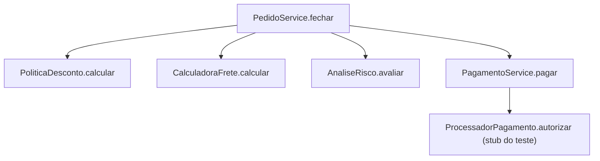
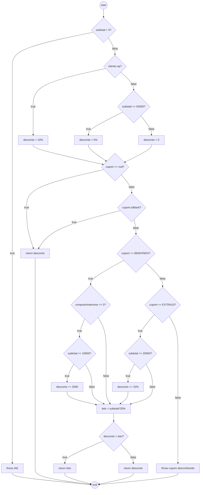
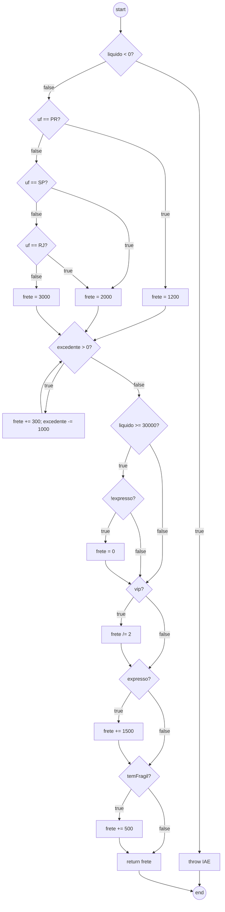
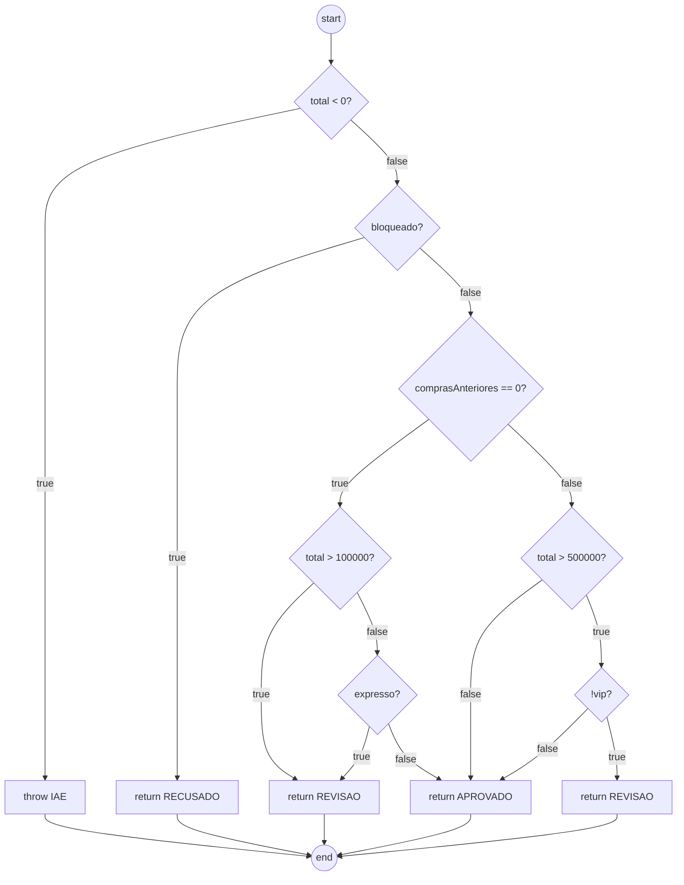
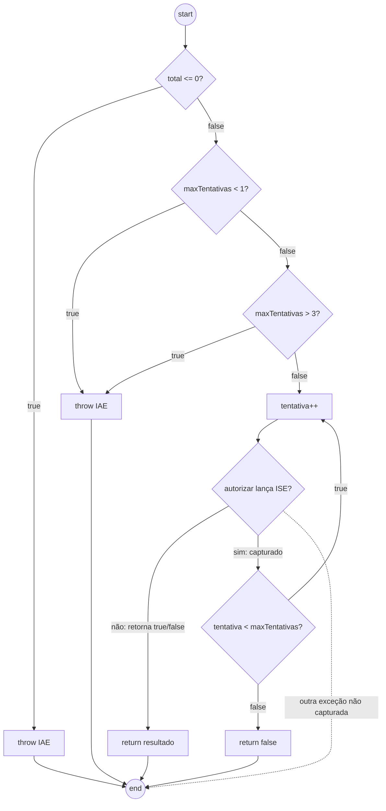
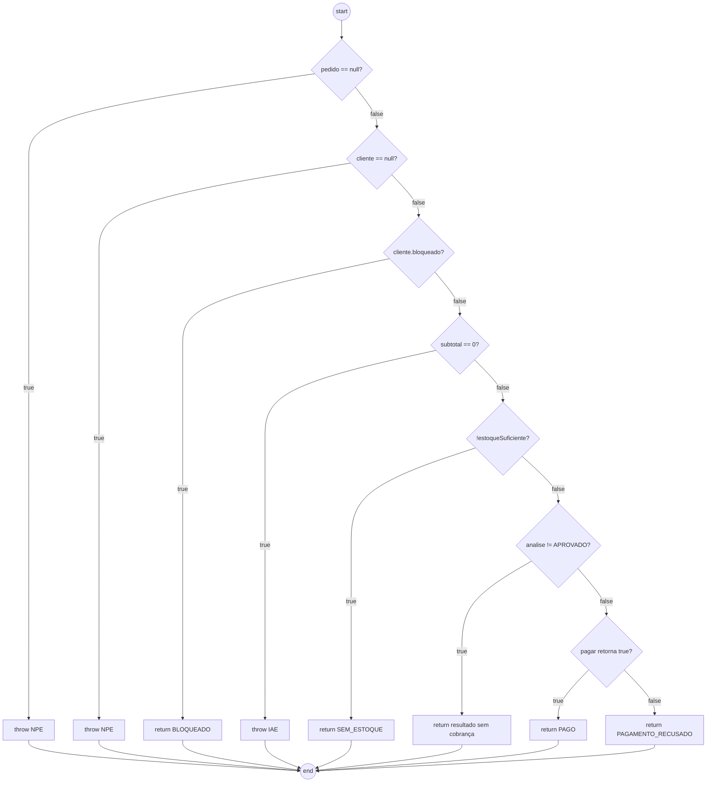

# Relatório do grupo

Integrantes: André Tavares (24066498-2)

## Grafos e complexidade

Pra montar os grafos a gente seguiu essa lógica: cada lado de um `&&`/`||`
vira um nó de decisão separado (o segundo lado só entra se o primeiro não
resolver sozinho), cada `case` do switch é tratado como um `else if`, e todo
`return`/`throw` termina no mesmo nó final, senão não dá pra aplicar direito
o `V(G) = E - N + 2`. Laço conta como uma decisão só, não importa quantas
vezes ele roda.

Chamadas do `PedidoService.fechar`:

`PoliticaDesconto.calcular`:

`CalculadoraFrete.calcular`:

`AnaliseRisco.avaliar`:

`PagamentoService.pagar`:

Aqui tem uma aresta pontilhada saindo do `H3` direto pro `end`: é quando
estoura uma exceção diferente de `IllegalStateException` dentro do `try`.
Ela não vira decisão de código (não tem `if` pra ela), mas conta como
aresta na hora de somar `E - N + 2`, por isso o número não bate certinho
com "quantidade de decisões + 1" nesse método.

`PedidoService.fechar`:

| Método | Nós | Arestas | V(G) | Caminhos independentes | Restrições de viabilidade |
| --- | --- | --- | --- | --- | --- |
| `PoliticaDesconto.calcular` | 23 | 33 | 12 | 12 | nenhuma |
| `CalculadoraFrete.calcular` | 22 | 31 | 11 | 11 | nenhuma |
| `AnaliseRisco.avaliar` | 14 | 20 | 8 | 8 | nenhuma |
| `PagamentoService.pagar` | 13 | 18 | 7 | 6 | a exceção não capturada soma uma aresta a mais do que o número de decisões (6) |
| `PedidoService.fechar` | 17 | 23 | 8 | 8 | o caminho SEM_ESTOQUE com cupom inválido só existe aqui porque a checagem de estoque vem antes da checagem do cupom; sozinho em `PoliticaDescontoTest` esse cupom daria erro |

## Matriz de testes

| ID / método JUnit | Unidade | Entrada e estado do stub | Resultado esperado | Caminho / aresta | Critério atendido |
| --- | --- | --- | --- | --- | --- |
| `clienteVipRecebeDezPorCento` | PoliticaDesconto | vip, subtotal 1000,00 | desconto 100,00 | ramo vip | classe de equivalência |
| `cupomDesconhecidoLancaExcecao` | PoliticaDesconto | cupom "NAOEXISTE" | IllegalArgumentException | default do switch | classe inválida |
| `descontoCombinadoRespeitaTetoDeVintePorCento` | PoliticaDesconto | vip + BEMVINDO, subtotal 100,00 | desconto capado em 20,00 | teto do desconto | condição composta |
| `baseParanaSemPesoExcedenteEValorBaixo` | CalculadoraFrete | UF PR, peso 1kg | frete 12,00 | ramo PR do switch | classe de equivalência |
| `semExcedenteNoLimiteExatoDeDoisQuilos` | CalculadoraFrete | peso 2000g | sem cobrança extra | 0 iterações do while | limite (0 iterações) |
| `freteGratuitoNaoSeAplicaAPedidoExpresso` | CalculadoraFrete | líquido 300,00, expresso | frete não zera | curto-circuito do `&&` | condição composta |
| `comComprasAnterioresClienteVipEAprovadoMesmoComTotalAlto` | AnaliseRisco | com histórico, total alto, vip | APROVADO | `!vip` falso no `&&` | curto-circuito |
| `deveEsgotarTentativasEDevolverFalsoQuandoSempreIndisponivel` | PagamentoService | ISE nas 3 tentativas | false, 3 chamadas | limite do laço | esgotamento de tentativas |
| `devePropagarExcecoesQueNaoSaoIndisponibilidadeTemporaria` | PagamentoService | RuntimeException | propaga | aresta não capturada | exceção não tratada |
| `deveRetornarSemEstoqueAntesDeAplicarOuValidarOCupom` | PedidoService | estoque insuficiente, cupom inválido | SEM_ESTOQUE, sem exceção | checagem de estoque antes do desconto | caminho inviável na unidade isolada |
| `deveFecharPedidoDeClienteComumComFreteDoParanaEPagamentoAprovado` | PedidoService | caminho completo, pagamento aprovado | PAGO | caminho feliz completo | colaboração entre classes |

As demais classes de teste cobrem validação de campo e os métodos de
agregação de `Pedido` (subtotal, peso, item frágil, estoque), que não
entraram na tabela de complexidade por serem métodos mais simples.

## Evolução da cobertura

| Etapa | Testes executados | Linhas | Branches | Métodos | Classes | Lacunas e justificativas |
| --- | --- | --- | --- | --- | --- | --- |
| Inicial | 1 | não medido | não medido | não medido | não medido | só tinha o teste de exemplo |
| Depois desta entrega | 88 (todos passando) | 108/108 (100%) | 116/116 (100%) | 21/21 (100%) | 9/9 (100%) | `mvn clean test` rodado com JaCoCo; nenhuma linha, ramo, método ou classe do pacote `pedidos` ficou de fora |

## Análise crítica

**Quais combinações faltavam mesmo com os ramos cobertos?**
Testar vip e expresso separados não garante que os dois juntos (com peso
excedente e item frágil) dão o valor certo, já que o frete é calculado em
cima do resultado anterior (zera, depois divide por vip, depois soma
expresso, depois soma frágil). Tem um teste específico só pra essa
combinação.

**Quais condições não foram avaliadas por causa do curto-circuito?**
No `AnaliseRisco`, se o total é menor ou igual a 500.000 o `!vip()` nem
chega a ser avaliado. No `PoliticaDesconto`, se o cupom é nulo o
`isBlank()` nem é chamado, e se o cliente já comprou antes a condição do
subtotal mínimo do BEMVINDO também não entra.

**Quais caminhos são inviáveis no serviço mas viáveis na unidade isolada?**
Um cupom desconhecido é válido pra testar `PoliticaDesconto` sozinha (dá
erro), mas dentro do `fechar` esse caminho nunca acontece se o pedido
também não tiver estoque, porque a checagem de estoque vem antes da
checagem do cupom.

**Como foram testadas as exceções e as quantidades de iteração?**
No `PagamentoService` a gente testou aprovação direta, indisponibilidade
temporária com nova tentativa, esgotamento das tentativas e uma exceção
diferente (que propaga sem ser tratada, e não conta como branch no
JaCoCo mesmo assim testamos). O laço do frete foi testado com 0, 1 e 2
frações de peso excedente.

**Qual alteração proposital foi detectada e foi desfeita?**
Trocamos o limite `total > 500_000` de `AnaliseRisco` pra `600_000` e rodamos
a suíte de novo. Só o `comComprasAnterioresETotalAltoSemVipVaiParaRevisao`
quebrou (esperava REVISAO e veio APROVADO), o que faz sentido porque é o
único teste que usa um total entre 500.000 e 600.000 pra esse caminho.
Voltamos o limite pra `500_000` e a suíte passou de novo, os 88 testes
verdes.
